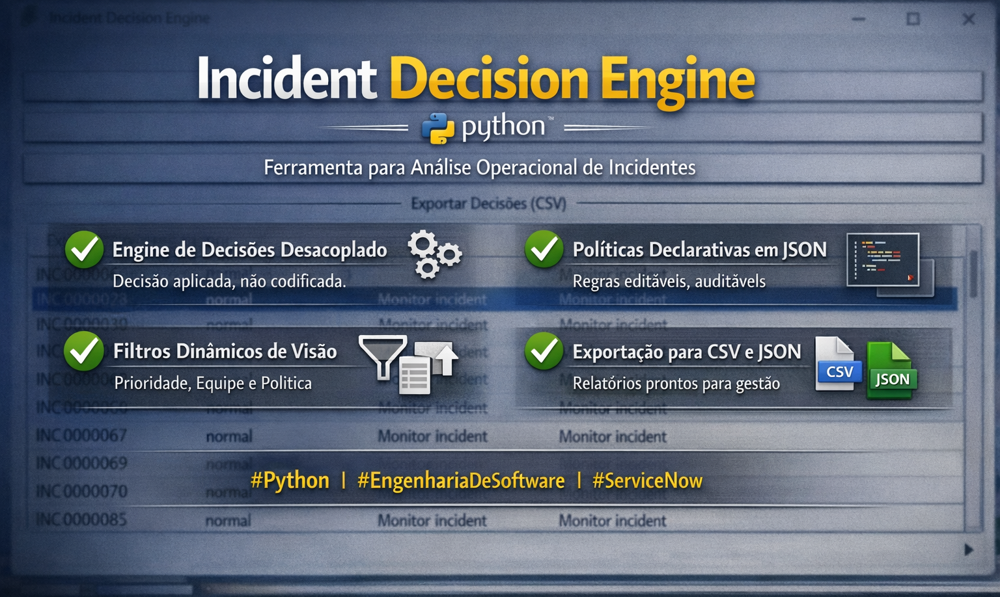
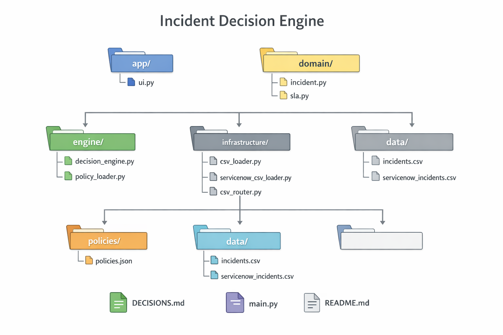

# Incident Decision Engine

O **Incident Decision Engine** é uma aplicação desktop desenvolvida em **Python (Tkinter)** para **apoio à tomada de decisão operacional sobre incidentes**, inspirada no modelo de dados e funcionamento do **ServiceNow**.

O sistema consome **exportações CSV de incidentes**, aplica **políticas declarativas de decisão** e gera **ações recomendadas**, permitindo visualização, filtragem e exportação dos resultados.

> 🎯 Foco do projeto: **engenharia de software aplicada** — arquitetura limpa, decisões explícitas, separação de responsabilidades e evolução sustentável.

---

## ✨ Funcionalidades Principais

- ✅ Importação de incidentes via **CSV**
  - CSV genérico
  - CSV estilo ServiceNow (com campos de SLA via dot-walk)
- ✅ **Motor de decisões desacoplado**, baseado em políticas
- ✅ Políticas externas e versionáveis (**JSON**)
- ✅ Interface gráfica desktop utilizando Tkinter
- ✅ Filtros por **prioridade** e **política aplicada**
- ✅ Exportação dos resultados:
  - 📄 CSV (uso gerencial / Excel)
  - 📦 JSON (uso técnico / automação)
- ✅ Suporte a grande volume de incidentes
- ✅ Compatível com ambientes corporativos restritos (somente stdlib)

---

## 🧠 Conceito Central

O sistema **não recalcula SLA** nem se integra diretamente ao ServiceNow.

Premissas:
- O CSV já deve ser exportado com **filtros corretos** aplicados
- O percentual de SLA é tratado como **fonte de verdade**
- O objetivo é **análise e decisão operacional**, não cálculo de SLA

Essa abordagem torna o sistema:
- mais simples
- mais seguro
- alinhado com práticas reais de ambientes corporativos

---

## Visão Geral do Projeto

Imagem ilustrativa da arquitetura conceitual e das funcionalidades principais
do Incident Decision Engine:



---

### Requisitos mínimos do CSV

O arquivo CSV de entrada deve conter, no mínimo, os seguintes campos:

- number
- assignment_group
- impact
- urgency
- sla_percentage
- sla_paused

Campos adicionais são permitidos e serão ignorados.

---

## 🏗️ Arquitetura

O projeto segue uma **arquitetura em camadas**, com responsabilidades claramente definidas.

📁 **Camadas principais**:
- `app/` → Interface gráfica (Tkinter)
- `domain/` → Modelo de domínio (Incident, SLA, Decision)
- `engine/` → Motor de decisão e carregador de políticas
- `infrastructure/` → Loaders de dados e exporters
- `policies/` → Políticas declarativas (JSON)
- `data/` → Conjuntos de dados de exemplo (CSV)
- `docs/` → Documentação arquitetural

📐 Diagrama de arquitetura:
```

```

---

## 📂 Estrutura do Projeto

```text
incident_decision_engine/
├── app/
│   └── ui.py
│
├── domain/
│   ├── incident.py
│   ├── sla.py
│   └── decision.py
│
├── engine/
│   ├── decision_engine.py
│   └── policy_loader.py
│
├── infrastructure/
│   ├── csv_loader.py
│   ├── servicenow_csv_loader.py
│   ├── csv_router.py
│   └── decision_exporter.py
│
├── policies/
│   └── policies.json
│
├── data/
│   ├── incidents.csv
│   └── servicenow_incidents.csv
│
├── docs/
│   └── architecture.png
│
├── DECISIONS.md
├── README.md
└── main.py
```

---

## 🚀 Como Executar

### Pré-requisitos
- Python 3.9+
- Nenhuma biblioteca externa

### Execução
```bash
python main.py
```

### Fluxo de uso
1. Abrir a aplicação
2. Selecionar um arquivo CSV
3. Processar incidentes
4. Aplicar filtros (opcional)
5. Exportar resultados (CSV ou JSON)

---

## 🧩 Políticas de Decisão

As decisões são definidas por **políticas declarativas em JSON**.

Exemplo:

```json
{
  "name": "high_sla_risk_high_impact",
  "conditions": {
    "sla_percentage_gte": 75,
    "impact": 1
  },
  "actions": [
    "Notify manager via email",
    "Schedule follow-up in 24h"
  ],
  "priority": "high"
}
```

As políticas são:
- versionáveis
- auditáveis
- independentes do código

---

## 📜 Decisões Arquiteturais

As principais decisões técnicas do projeto estão documentadas em:
```
DECISIONS.md
```

Esse documento descreve:
- por que o CSV foi escolhido
- por que o SLA não é recalculado
- por que as políticas são externas
- por que a UI atua apenas como orquestração
- como o projeto foi pensado para evoluir

---

## 🔐 Segurança da Informação

- ✅ Nenhuma integração direta com ServiceNow
- ✅ Nenhuma credencial utilizada
- ✅ Nenhum dado sensível armazenado
- ✅ Uso de dados genéricos/simulados
- ✅ Execução totalmente local

Adequado para:
- ambientes corporativos
- demonstrações técnicas
- ferramentas internas
- portfólio público

---

## 🎓 Objetivo do Projeto

Este projeto foi desenvolvido como um **exercício prático de engenharia de software**, com foco em:

- arquitetura limpa
- decisões explícitas
- separação de responsabilidades
- evolução sem refatoração
- uso consciente de automação e IA

Mais do que uma ferramenta funcional, o projeto serve como **estudo de caso de engenharia aplicada**.

---

## ✅ Status

- Versão: **v1.0**
- Escopo fechado
- Arquitetura estável
- Pronto para uso e apresentação

---

## 👤 Autor

Desenvolvido por **Lucas Mattos**  
Projeto de estudo, inspirado em cenários reais de gestão de incidentes.
